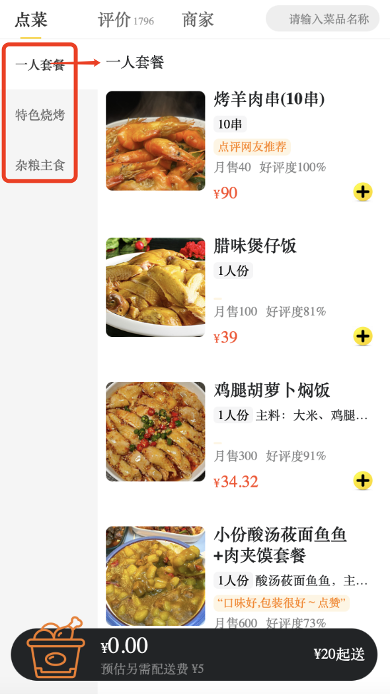
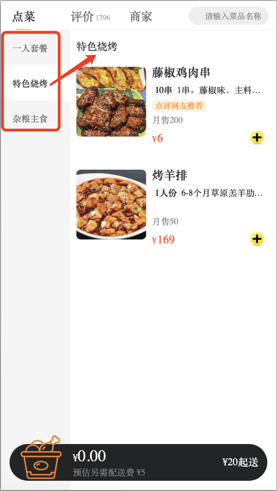
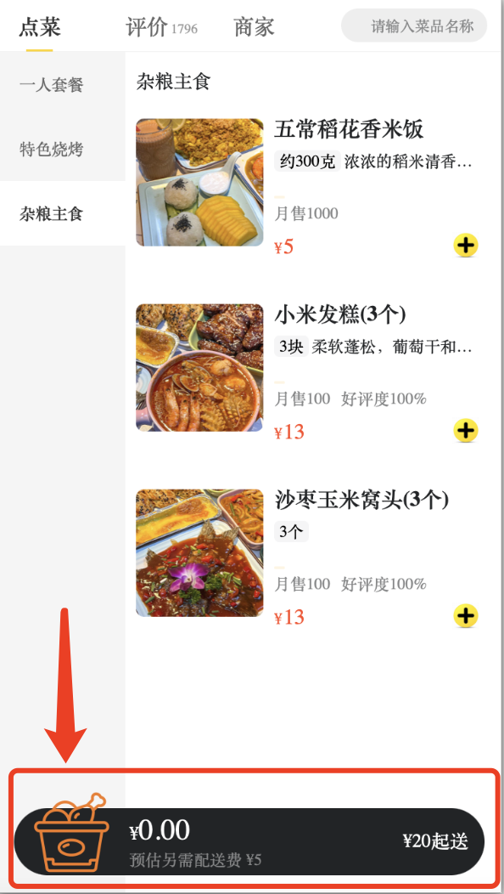
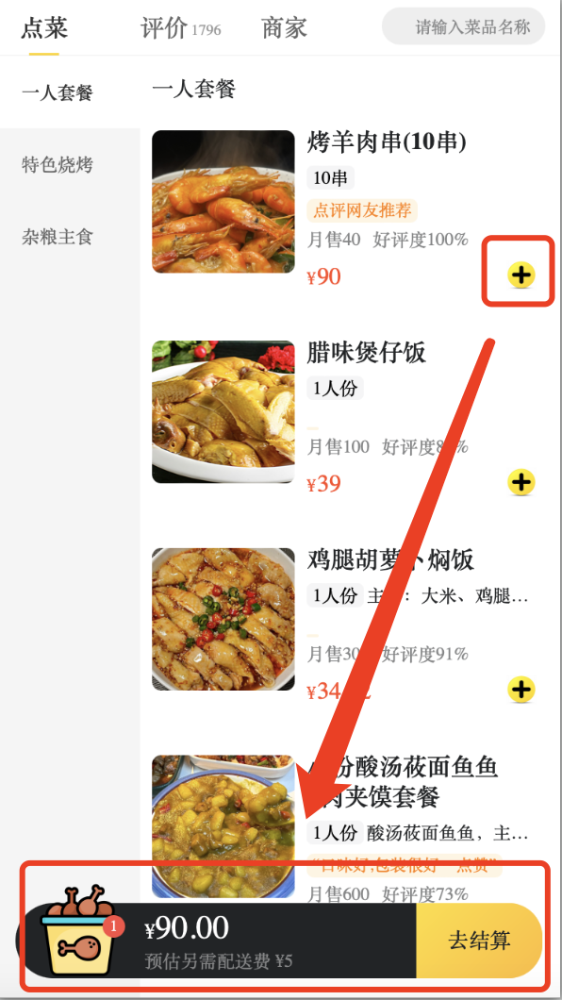
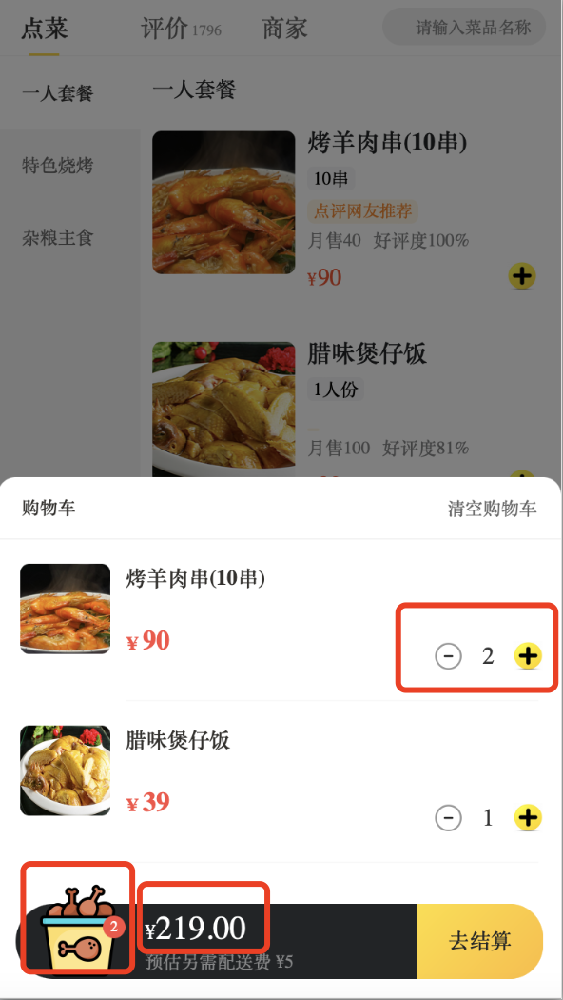

# MeituanDeliveryFood

Developed a food delivery platform inspired by Meituan Takeout, using **React** for building a dynamic and responsive web application.


# Start mock api service

```bash
npm run serve
```

# Start Program

```bash
npm run start

```

# Introduction of features

### 1. Switch Categories



### 2. Set cart empty initially


### 3. Add items to cart


### 4. show cart details and computed the total count and total price
